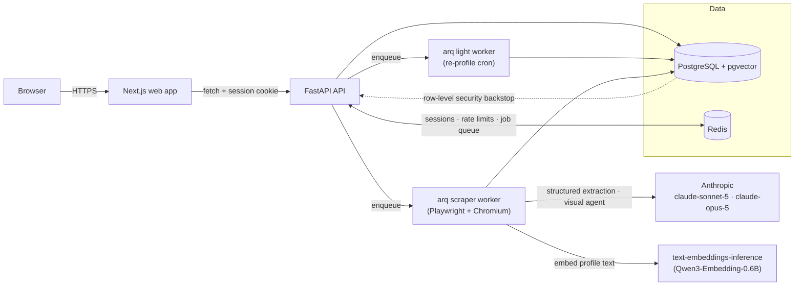

# ReScope

A multi-tenant CRM that profiles companies from their own website. Paste a domain; a background
pipeline reads the site and pulls out its overview, products, services, and competencies — each
with a source URL and quote — then embeds the result so you can search your accounts semantically
and find similar companies.

See [`docs/ARCHITECTURE.md`](docs/ARCHITECTURE.md) for how it's built and why, including where the
implementation ended up diverging from the original plan in [`docs/PLAN.md`](docs/PLAN.md).

<!-- A recording of the app end to end goes here — signup, adding a company, watching it get
     profiled, and the CRM layer on top. Not yet captured; see git history for when this comment
     is resolved. -->

## What it does

- **AI profiling, tiered by how much a site needs.** A no-LLM discovery pass (robots.txt, sitemap,
  homepage links) feeds a text-extraction pass over rendered pages; a site whose content sits
  behind tabs, accordions, or infinite scroll escalates to a custom visual browser agent that
  clicks around like a person would, screenshotting evidence as it goes.
- **Evidence, not just claims.** Every extracted product, service, and competency links back to the
  exact page and quote it came from.
- **Semantic search and similar companies** — embed a query or a company's own summary and rank
  every account in your tenant by cosine distance, powered by a self-hosted embedding model so
  there's no per-search API cost.
- **Scheduled re-profiling** — a company gets re-scraped on a plan-dependent interval, and a diff
  against its previous profile lands in a changes feed.
- **A light CRM on top** — contacts (with CSV import), notes, tags, and personal saved searches.
  No deals or pipeline stages; the profiling pipeline is the product, this just makes it usable
  day to day.
- **Subdomain-per-tenant, isolated three ways** — the tenant is resolved from the `Host` header
  (never the URL path or request body), every cross-tenant reference is impossible at the database
  level via composite foreign keys, and Postgres row-level security backstops both.
- **Platform-paid LLM, quota'd per plan** — one Anthropic key funds every tenant's scraping; each
  plan gets its own monthly profile and deep-run ceilings, enforced before a job is ever enqueued,
  with a platform-wide killswitch for the operator.

## Architecture



The rule that keeps it maintainable: **routers never contain logic, services never import
FastAPI.** See `docs/ARCHITECTURE.md` §2–§3 for the full reasoning.

## Quickstart

```bash
git clone git@github.com:Amboyandrey/ReScope.git && cd ReScope
docker compose -f infra/docker-compose.yml up --build
```

That starts `postgres`, `redis`, `embeddings`, `api`, `worker`, `scraper`, and `web` together. The
API image runs its migrations on boot.

- **Web** — http://rescope.localhost:3000 (any subdomain of `.localhost` resolves to loopback on
  its own — no `/etc/hosts` edits needed)
- **API** — http://api.rescope.localhost:8000 (interactive docs at `/docs`)

Sign up, create a workspace, and add a company by its domain. Without a real `ANTHROPIC_API_KEY`
set before the first boot, the scrape will finish in a "failed" state at the extraction step — that
key is what actually reads and profiles a site, and this repo obviously can't ship one. Set it in
your shell before `docker compose up`, or add it to the `api`, `worker`, and `scraper` services'
environment directly.

To see the app populated without a key, seed the demo tenant instead — it writes two already-
profiled fictional companies straight into the database, bypassing the scraper entirely:

```bash
docker compose -f infra/docker-compose.yml exec api \
  /app/.venv/bin/python -m app.scripts.seed_demo
```

Sign in at `demo.rescope.localhost:3000` with `demo@rescope.app` / `demo-password-123` (or pass
your own email/password as arguments to the script). Re-running it is safe — it's a no-op once the
tenant exists.

## Repository layout

```
apps/api/          FastAPI backend (Python 3.12)
  app/core/           settings, db/redis engines, security, SSRF guard, cookies, middleware
  app/models/         SQLAlchemy ORM models
  app/schemas/        Pydantic request/response shapes
  app/services/       business logic — no FastAPI imports, fully unit-testable
  app/routers/v1/     HTTP surface — thin, delegates to services
  app/scraping/       the three-tier profiling pipeline (discovery, render, extraction, visual agent)
  app/workers/        arq background jobs — the scraper, and the light worker's re-profile cron
  app/deps/           the auth → tenant → role dependency chain
  app/scripts/        one-off scripts (superadmin promotion, demo seed)
  migrations/         Alembic, one revision per schema change
  tests/              pytest, 116 tests, against a real Postgres/Redis
apps/web/           Next.js 16 (App Router), React 19, Tailwind 4
  app/                routes — auth, tenant switcher, per-tenant company pages, admin
  lib/                one typed API client per domain
  components/         shared UI
infra/              docker-compose.yml (dev), docker-compose.prod.yml + Caddyfile (production)
docs/               PLAN.md (the up-front design), ARCHITECTURE.md (what was actually built)
```

## Local development without Docker

Run the data services via compose, everything else natively for hot reload:

```bash
docker compose -f infra/docker-compose.yml up postgres redis embeddings

cd apps/api && uv sync && uv run alembic upgrade head
uv run uvicorn app.main:app --reload --port 8000

# a second terminal, for the re-profile cron:
cd apps/api && uv run arq app.workers.main.WorkerSettings

# a third, for scraping (needs Playwright's browser binary installed once: uv run playwright install chromium):
cd apps/api && uv run arq app.workers.scraper.WorkerSettings

cd apps/web && pnpm install && pnpm dev
```

## Testing

```bash
cd apps/api && uv run ruff check . && uv run ruff format --check . && uv run mypy app && uv run pytest -q
cd apps/web && pnpm lint && pnpm typecheck && pnpm test && pnpm build
```

`tests/conftest.py` forces a `_test`-suffixed database and a separate Redis db index before any app
code loads, so running the suite locally can never touch a dev stack's data. Discovery and
extraction are mocked; Playwright-dependent tests launch a real headless Chromium with only the LLM
call mocked, closer to what actually runs than mocking the browser too.

CI (`.github/workflows/ci.yml`) runs the same checks on every push and pull request.

## Production deployment

```bash
cd infra
cp .env.example .env   # fill in DOMAIN, POSTGRES_PASSWORD, RESCOPE_APP_ROLE_PASSWORD, etc.
docker compose -f docker-compose.prod.yml --env-file .env up -d --build
```

Point `DOMAIN` and `*.DOMAIN`'s DNS records at the host. Caddy (`Dockerfile.caddy`, `Caddyfile`)
terminates a wildcard TLS certificate via the ACME DNS-01 challenge and routes `api.<domain>` to
the API container, everything else to the web container — see `docs/ARCHITECTURE.md` §9 for why
that split needs to be explicit in production when dev gets it for free from two different ports.
The example config targets Cloudflare for the DNS challenge; swap `Dockerfile.caddy`'s `xcaddy`
line and the `Caddyfile`'s `dns` directive together to use a different provider.

## Security

- Argon2id password hashing; opaque Redis-backed sessions, not JWTs
- Double-submit CSRF cookie, checked on every mutating request
- SSRF guard on every user-supplied URL (a company's domain), re-checked at company-creation time
  and again inside the scraper
- Tenancy enforced three ways at once: header-only tenant resolution (never a URL path), composite
  foreign keys, and Postgres row-level security under a dedicated low-privilege runtime role — see
  `migrations/_rls.py`'s own docstring for the reasoning worth knowing before touching it
- The platform's own Anthropic key lives in the environment only, never a database row or a
  response schema field
- Every privileged action (company deletion by someone other than its creator, a role change, the
  platform-wide scraping killswitch) writes an audit row

## Status

Feature-complete for what it set out to be: subdomain-per-tenant multi-tenancy with RLS, the
three-tier scraping pipeline with evidence-linked extraction, semantic search and similar
companies, usage metering and plan quotas with a superadmin killswitch, a light CRM, scheduled
re-profiling with a changes feed, and a production deployment path behind a wildcard-TLS reverse
proxy.

What's deliberately absent — hybrid (`tsvector` + vector) search, an HNSW index, deals/pipeline
CRM stages, and per-tenant LLM keys — is listed with the reasoning in `docs/ARCHITECTURE.md` §5,
§6, and §8.
